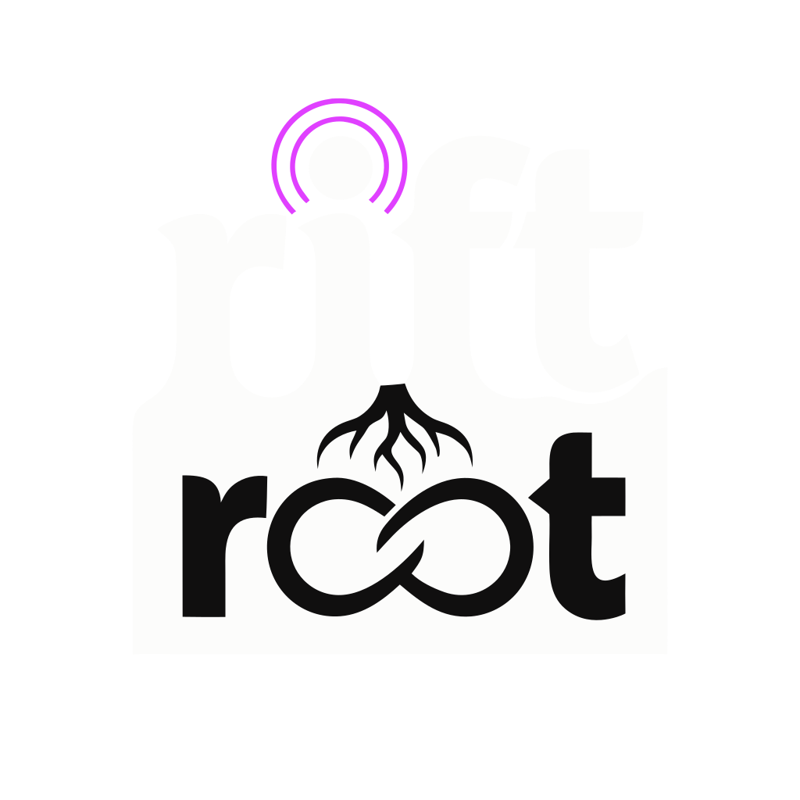

## Rift Root LLC

Sovereign AI execution infrastructure for environments that resist it.

Most AI tooling assumes unconstrained outbound access to provider APIs. In firewalled enterprises, air-gapped environments, and regulated networks, that assumption breaks completely. Rift Root builds Erebus Edge for exactly that condition: keys stay server-side in a KV vault, zero-trust auth gates every surface, and the only traffic crossing the perimeter is signed webhook ingest.

A five-layer architecture — perimeter, control plane, intelligence, execution, observability — driven by a LinUCB multi-armed bandit closed by a reward signal that flows from observability back to intelligence and gets measurably better at every dispatch decision.

Bootstrapped. Northern Colorado.

→ [riftroot.com](https://riftroot.com) · [erebus architecture](https://riftroot.com/#erebus) · [erebus-edge repo](https://github.com/riftroot/erebus-edge)